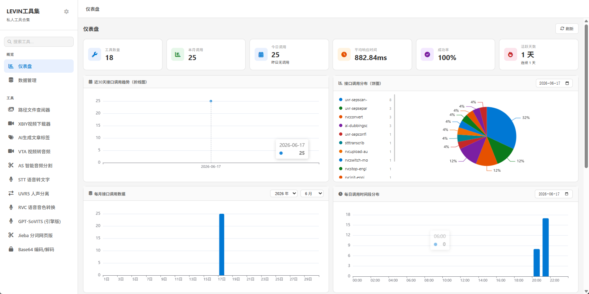
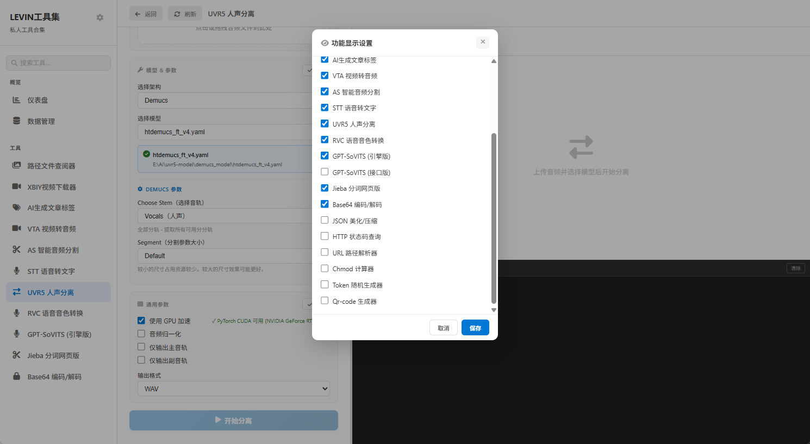
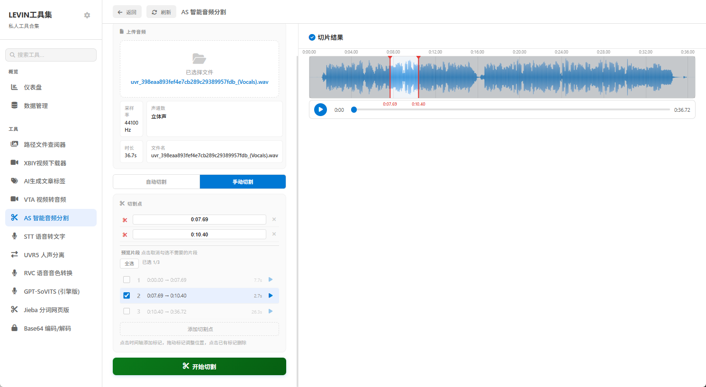

# Flask 开发工具 API

一个基于 Flask 的实用工具集 Web 应用，提供各种开发和多媒体处理工具。

## 功能特性

### 界面预览

<table>
  <tr>
    <td></td>
    <td></td>
    <td></td>
  </tr>
</table>

### 开发工具
- **Chmod 计算器** - 文件权限计算器
- **JSON 格式化** - JSON 数据格式化与验证
- **URL 解析器** - URL 参数解析与分析
- **Base64 编解码** - Base64 数据编解码
- **HTTP 状态码查询** - HTTP 状态码参考
- **Token 生成器** - 安全 Token 生成
- **QR 码生成器** - 二维码生成

### 多媒体工具
- **图片拼接** - 多图拼接工具
- **视频下载** - 支持 Twitter/Bilibili/Instagram/YouTube 视频下载
- **AI 配音** - AI 语音配音
- **RVC 语音转换** - RVC 语音变声工具
- **SoVITS 文本转语音** - TTS 文本转语音
- **语音转文本** - STT 语音识别
- **分词工具** - 中文分词处理
- **MP4 转音频** - 视频提取音频
- **音频切片** - 音频文件切片处理
- **人声分离** - UVR 人声分离工具

### 其他功能
- **数据管理** - 数据管理界面
- **内容标签** - 内容标签处理

## 安装与配置

### 前置要求
- Python 3.8+
- pip (Python 包管理器)

### 安装步骤

1. **克隆或下载项目**
   ```bash
   cd flask-dev-api
   ```

2. **创建虚拟环境**
   ```bash
   python -m venv .venv
   ```

3. **激活虚拟环境**
   
   Windows:
   ```bash
   .venv\Scripts\activate
   ```
   
   macOS/Linux:
   ```bash
   source .venv/bin/activate
   ```

4. **安装依赖**
   ```bash
   pip install -r requirements.txt
   ```

5. **配置设置**
   
   编辑 `config.py` 文件，根据需要配置：
   - `AUTO_OPEN_BROWSER` - 启动时是否自动打开浏览器
   - `LOGIN_ENABLED` - 是否启用登录
   - `DEFAULT_OUTPUT_DIR` - 默认下载目录
   - `PROXY_URL` - 代理服务器地址

6. **运行应用**
   ```bash
   start run_tools.cmd
   ```
   
   或直接运行：
   ```bash
   python app.py
   ```

## 配置说明

### 视频下载配置
如需使用视频下载功能，请配置以下 Cookie 文件：
- `config/dv_cookies/x.com_cookies.txt` (Twitter/X)
- `config/dv_cookies/bilibili.com_cookies.txt` (Bilibili)
- `config/dv_cookies/instagram.com_cookies.txt` (Instagram)
- `config/dv_cookies/youtube.com_cookies.txt` (YouTube)

### 分词工具配置
编辑 `config/fen_ci/usertoken.json` 配置相关 Token。

### 代理设置
如需代理访问外网，在 `config.py` 中设置 `PROXY_URL`。

## 项目结构

```
flask-dev-api/
├── blueprints/           # Flask 蓝图模块
│   ├── pin_tu.py        # 图片拼接
│   ├── chmod_calc.py    # 权限计算器
│   ├── qr_code.py       # 二维码生成
│   └── ...              # 其他工具模块
├── templates/            # HTML 模板
├── static/              # 静态文件（CSS/JS）
├── utils/               # 工具函数库
├── config/              # 配置文件目录
├── config.py            # 全局配置
└── run_tools.cmd        # 启动脚本
```

## 使用说明

1. 启动服务后，访问 `http://localhost:5000`
2. 根据需要选择对应的工具
3. 部分工具需要配置相应的密钥或 Cookie 才能使用
4. 所有工具都可以通过 Web 界面直接使用

## 注意事项

- 视频下载功能需要配置相应的 Cookie 文件
- 部分工具可能需要网络代理才能正常使用
- 默认管理员账号：admin/123456（可选开启）
- 默认服务端口：5000

## 开发与贡献

### 添加新工具
1. 在 `blueprints/` 目录创建新的蓝图文件
2. 在 `templates/` 目录添加对应的 HTML 模板
3. 在 `config.py` 中添加相关配置（如需要）
4. 在主应用中注册蓝图

### 代码规范
- 遵循 Python PEP 8 规范
- 使用中文注释说明主要功能
- 保持代码简洁和模块化

## 许可证

本项目为开源项目，仅供学习和个人使用。

## 更新日志

- **2026-06-17** - 项目初始化，完成基础功能开发